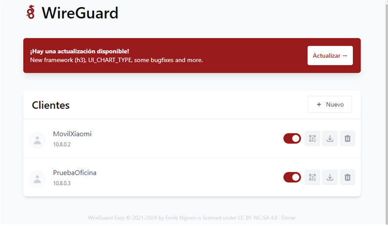

# Actualizaciones del Servicio WireGuard en Docker

Durante el periodo de pruebas, me he encontrado con que la versión de WireGuard Easy que se está usando en este proyecto tiene una actualización disponible que se ha notificado directamente en la consola de administración de usuarios.



La ocasión ha sido perfecta para demostrar una vez más las ventajas de haber elegido desplegar el servicio sobre un contenedor Docker, ya que el proceso de actualización es bastante simple y toma apenas un par de minutos. Remitiéndome al propio repositorio de GitHub, en la sección de actualizaciones (updating), encontramos instrucciones simples que pasan por detener el servicio, eliminar la imagen actual, adquirir la nueva imagen y poner en marcha nuevamente el servicio.

El proceso de actualización se puede realizar en cuatro pasos usando comandos de Docker directamente sin usar Docker Compose:

1. Detener el contenedor:
    ```bash
    docker stop wg-easy
    ```

2. Eliminar el contenedor vigente:
    ```bash
    docker rm wg-easy
    ```

3. Adquirir la nueva imagen:
    ```bash
    docker pull ghcr.io/wg-easy/wg-easy
    ```

4. Reiniciar el servicio en segundo plano:
    ```bash
    docker run -d
    ```

Aunque este método es efectivo, totalmente válido y el resultado es el mismo usando comandos de Docker o Docker Compose, mi intención es simplemente demostrar nuevamente la ventaja de trabajar con Docker Compose. Aunque de momento solo tengo un servicio, pude haber actualizado la imagen, que con comandos de Docker me tomó 4 pasos, en un único paso usando el comando:

```bash
docker compose up --detach --pull
```

Tomando aproximadamente dos minutos, la actualización restablece el servicio actualizado que, entre otras novedades, ahora incluye un modo o tema oscuro.
